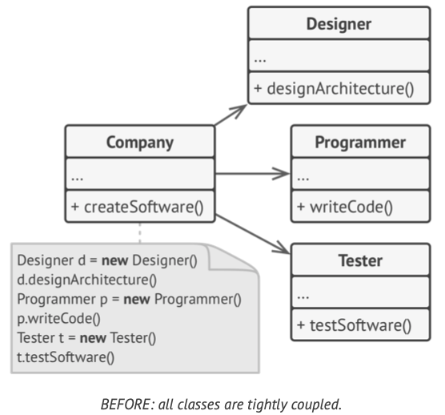
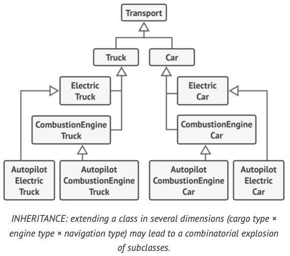
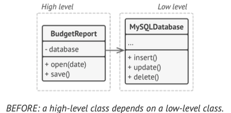

# Software design principles

Things to aim for and things you'd better avoid:

-   Code reuse

    Code reuse is one of the most common ways to reduce devel- opment costs. The _intent_ is pretty obvious: instead of developing something over and over from scratch, why don't we reuse existing code in new projects?

    The idea looks great on paper, but it turns out that making existing code work in a new context usually takes extra effort. Tight coupling between components, dependencies on concrete classes instead of interfaces, hardcoded operations; all of this reduces flexibility of the code and makes it harder to reuse it.

    Take what varies and _encapsulate_ it so it won't affect the rest of your code. The result? Fewer unintended consequences from code changes and more flexibility in your systems!

    Simply told: if you've got some aspect of your code that is changing, say with every new requirement, then you know you've got a behavior that needs to be pulled out and separated from all the stuff that doesn't change.

-   Extensibility

    > Change is the only constant thing in a programmer's life. There's a bright side tho: if someone asks you to change something in your app, that means someone still cares about it.

    First, we understand the problem better once we start to solve it. Often by the time you finish the first version of an app, you're ready to rewrite it from scratch because now you understand many aspects of the problem much better. You have also grown professionally, and your own code now looks like crap.

    That's why all seasoned developers try to provide and prepare for possible future changes when designing an application's architecture.

**Design principle(s):**

-   **_Program to an interface, not an implementation._**

    > _Program to an interface_ really means _Program to a supertype._

    You can tell that the design is flexible enough if you can easily extend it without breaking any existing code. Example how breaking down tighty coupled code into interfaces improves maintainability and extensibility:

    

    In the beginning, the `Company` class is tightly coupled to concrete classes of employees. However, despite the difference in their implementations, we can generalize various work-related methods and then extract a common interface for all employee classes.

    After doing that, we can apply polymorphism inside the `Company` class, treating various employee objects via the `Employee` interface.

    

    But, the `Company` class remains coupled to the employee classes. This is bad because if we introduce new types of companies that work with other types of employees, we'll need to override most of the `Company` class instead of reusing that code.

    

    To solve this problem, we could declare the method for get- ting employees as abstract. Each concrete company will implement this method differently, creating only those employees that it needs.

    After this change, the `Company` class has become independent from various employee classes. Now you can extend this class and introduce new types of companies and employees while still reusing a portion of the base company class. Extending the base company class doesn't break any existing code that already relies on it.

    Images above are an example of [Factory Method pattern](#the-factory-pattern).

-   **_Favor composition over inheritance._**

    Inheritance is probably the most obvious and easy way of reusing code between classes. You have two classes with the same code. Create a common base class for these two and move the similar code into it. Unfortunately, inheritance comes with some caveats:

-   **_identify the aspects of your application that vary and separate them from what stays the same._**

    The main goal of this principle is to minimize the effect caused by changes. As a result, you spend less time getting the program back into working shape, implementing and testing the changes. The less time you spend making changes, the more time you have for implementing features.

    -   _A subclass can't reduce the interface of the superclass._ You have to implement all abstract methods of the parent class even if you won't be using them.
    -   _When overriding methods you need to make sure that the new behavior is compatible with the base one._
    -   _Inheritance breaks encapsulation of the superclass_ because the internal details of the parent class become available to the subclass.
    -   _Subclasses are tightly coupled to superclasses._ Any change in a superclass may break the functionality of subclasses.
    -   _Trying to reuse code through inheritance can lead to creat- ing parallel inheritance hierarchies._ Inheritance usually takes place in a single dimension. But whenever there are two or more dimensions, you have to create lots of class combina- tions, bloating the class hierarchy to a ridiculous size.

    There's an alternative to inheritance called **composition**. Whereas inheritance represents the 'is a' relationship between classes (a car is a transport), composition represents the 'has a' relationship (a car has an engine).

    

    

---

## SOLID Principles

SOLID is a mnemonic for five design principles intended to make software designs more understandable, flexible and maintainable. They are introduced by Robert Martin in the book _Agile Software Development, Principles, Patterns, and Practices_.

### Single Responsibility Principle

> _A class should have just one reason to change._

Try to make every class responsible for a single part of the functionality provided by the software, and make that responsibility encapsulated.

The single responsibility principle is one of the most commonly used design principles in object-oriented programming. You can apply it to classes, software components, and microservices.

To follow this principle, your class isn't allowed to have more than one responsibility, e.g., the management of entities or the conversion of data types. This avoids any unnecessary, technical coupling between responsibilities and reduces the probability that you need to change your class. It also lowers the complexity of each change because it reduces the number of dependent classes that are affected by it. However, be reasonable - there is no need to have multiple classes that all hold just one function. Try to find the right balance when defining responsibilities and classes.

The main goal of this principle is reducing complexity. Also, if a class does too many things, you have to change it every time one of these things changes. While doing that, you're risking breaking other parts of the class which you didn't even intend to change.

### Open/Closed Principle

> _Classes should be open for extension but closed for modification._

The main idea of this principle is to keep existing code from breaking when you implement new features.

A class is _open_ if you can extend it, produce a subclass and do whatever you want with it-add new methods or fields, override base behavior, etc.

The class is _closed_ (you can also say complete) if it's 100% ready to be used by other classes - its interface is clearly defined and won't be changed in the future.

But in terms of this principle, a class can be both open (for extension) and closed (for modification) at the same time. If a class is already developed andtested, trying to mess with its code is risky. Instead of changing the code of the class directly, you can create a subclass and override parts of the original class that you want to behave differently. You'll achieve your goal but also won't break any existing clients of the original class.

### Liskov Substitution Principle

> _When extending a class, remember that you should be able to pass objects of the subclass in place of objects of the parent class without breaking the client code._

The principle defines that objects of a superclass shall be replaceable with objects of its subclasses without breaking the application. That requires the objects of your subclasses to behave in the same way as the objects of your superclass. You can achieve that by following a few rules, which are pretty similar to the [_design by contract_](https://en.wikipedia.org/wiki/Design_by_contract) concept defined by Bertrand Meyer.

> This principle is named by Barbara Liskov, who defined it in 1987 in her work [Data abstraction and hierarchy](https://pdfs.semanticscholar.org/36be/babeb72287ad9490e1ebab84e7225ad6a9e5.pdf).

Unlike other design principles which are wide open for inter- pretation, the substitution principle has a set of formal requirements for subclasses, and specifically for their methods:

-   _Parameter types in a method of a subclass should match or be more abstract than parameter types in the method of the super- class._ - Don't implement any stricter validation rules on input parameters than implemented by the parent class.
-   _The return type in a method of a subclass should match or be a subtype of the return type in the method of the superclass._ - Apply at the least the same rules to all output parameters as applied by the parent class.

    Example of breaking this rule would be when the base method returns a string, but the overridden method returns a number.

-   _A method in a subclass shouldn't throw types of exceptions which the base method isn't expected to throw._

### Interface Segregation Principle

> Client's shouldn't be forced to depend on methods they do not use.

According to the interface segregation principle, you should break down large interfaces into more granular and specific ones. Clients should implement only those methods that they really need. Otherwise, a change to a large interface would break even clients that don't use the changed methods.

### Dependency Inversion Principle

The general idea of this principle is as simple as it is important: High-level modules, which provide complex logic, should be easily reusable and unaffected by changes in low-level modules, which provide utility features. To achieve that, you need to introduce an abstraction that decouples the high-level and low-level modules from each other.

Based on this idea, Robert C. Martin's definition of the Dependency Inversion Principle consists of two parts:

-   High-level modules should not depend on low-level modules. Both should depend on abstractions.
-   Abstractions should not depend on details. Details should depend on abstractions.

An important detail of this definition is, that high-level and low-level modules depend on the abstraction. The design principle does not just change the direction of the dependency, as you might have expected when you read its name for the first time. It splits the dependency between the high-level and low-level modules by introducing an abstraction between them. So in the end, you get two dependencies:

-   the high-level module depends on the abstraction, and
-   the low-level depends on the same abstraction.

## Related/References

-   [Head First Design Patterns notes](../Books/Design_patterns.md)
