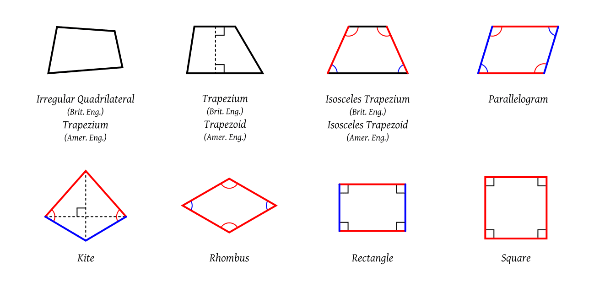
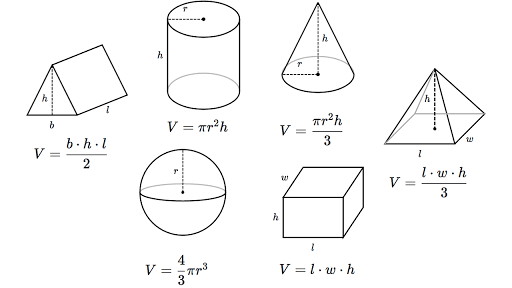
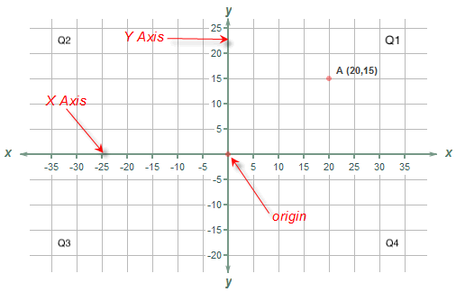

# Geometry

[[toc]]

---

## Area and perimeter

```
              d
        |-----------|
      c |           |
        |-----------|
```

**Area** is the space inside of a two-dimensional shape. We can also think of area as the amount of space a shape covers.

**Oblast(Area)** predstavlja celo područje unutrašnjeg dela geometrijske figure, mereno u jedinicama. Oblast pravougaone figure je definisan proizvod dve strane, i moze se izračunati uz pomoć sledeće formule: $$O = d * c$$

$$ height \times width = area $$

**Perimeter** is the distance around the outside of a two-dimensional shape.To find the perimeter of a shape, we add all of the shape's side lengths.

**Perimetar** je distanca potrebna da se obidje oko nekog objekta, ili matematički rečeno zbir svih strana geometrijske figure. Može se izračunati uz pomoć sledeće formule: $$P = (d *c)* 2$$ $$ (height \times width) \times 2 = perimeter $$

### Area formulas


## Lines

A **line** extends forever in both directions, like this:


A **line segment** is just part of a line. It has two endpoints, like this:


A **ray** starts at one point and continues on forever in one direction, like this:


**Perpendicular lines** are lines that meet at right angles.


Parallel lines are always the same distance apart from each other — no matter how far they are extended, they will never meet.


## Angles

An angle is two rays that share a vertex. Intersecting lines or line segments also form angles.

### Measuring angles

Angles are measured in degrees. The wider an angle is open, the greater its measure.

## Angle types

| Angle type | Angle size (in degrees)              |
| ---------- | ------------------------------------ |
| Acute      | Between $0\degree$ and $90\degree$   |
| Right      | Exactly $90\degree$                  |
| Obtuse     | Between $90\degree$ and $180\degree$ |
| Straight   | Exactly $180\degree$                 |

A **right angle** is a 90degree angle. A right angle is in the shape of a perfect corner, like the corner of a rectangular sheet of paper.

A **straight angle** is a 180 degree angle. A straight angle looks like a straight line.

An **acute angle** is an angle whose degree measure is less than 90 degree.

An **obtuse angle** is an angle whose degree measure is greater than 90 degree but less than 180 degree.

## Triangle types

> All of the internal angles of a triangle equal 180 degrees.

An **scalene** triangle is a triangle where none of the sides are equal.

An **isosceles** triangle is an angle where we have at least two sides that have same length.

An **equilateral** triangle is an triangle where all three sides have same length.

An **acute** tringle is the triangle where all of the angles have less than 90$\degree$.

An **right** is a triangle that have an angle that is exactly 90$\degree$.

An **obtuse** triangle is a triangle that have an angle that is larger than 90$\degree$.

## Symmetry

An shape is symmetrical if it has at least one line of symmetry.

The _line of symmetry_ is the imaginary line where you could fold the image and have both halves match exactly.

## Quadrilaterals

> A quadrilateral is a polygon with four sides.



**Parallelogram** is a quadrilateral where opposite sides are parallel - going in the same direction:


**Rhombus** is a type of parallelogram - the opossite sides have to be parallel and all sides must be equal.


> Square is a rhombus

**Rectangle** is kind of parallelogram where all the corners are the right angles.


**Square** is a parallelogram, rhombus and rectangle.

---

### Quadrilateral Summary

| Name          | Definition                       |
| ------------- | -------------------------------- |
| Quadrilateral | 4 sided closed figure            |
| Parallelogram | 2 pairs of parallel sides        |
| Trapezoid     | Exactly 1 pair of parallel sides |
| Rectangle     | 4 right angles                   |
| Rhombus       | 4 equal sides                    |
| Square        | 4 equal sides and 4 right angles |

---

## Volume

Volume is the amount of 3-dimensional space an object occupies and it is measured in cubic units.

### Volume formulas



#### How to use the volume formulas to calculate the volume

-   **Cube (Square)**

Given that the length of a side = a = 2 cm:

$$
Volume = (a) = 2cm × 2cm × 2cm = 8cm^3
$$

-   **Cylinder**

Given that the height is 8 inches and the radius is 2 inches:

$$
Volume = \pi × r^2 × h = 3.14 × (2 in)^2 × 8 in = 3.14 × 4 × 8 in^3 \\
Volume = 3.14 × 32 in^3 = 100.48 in^3
$$

-   **Rectangular solid or cuboid**

Given that the length is 6 cm, the width is 3 cm and the height is 5 cm:

$$
Volume = l × w  × h =  6 × 3 × 5 = 90 cm^3
$$

-   **Sphere**

Given that the radius = r = 20:

$$
Volume = (4 × π × r^3)/3 = [4 × 3.14 × (20)^3]/3 = 3.14 × (20)^3 × 4 \\
Volume = 3.14 × 8000 × 4 = 3.14 × 32000 = 100480
$$

-   **Cone**

Given that the radius is equal to 3 and the height is equal to 4:

$$
Volume = (π × r^2 × h)/3 = [3.14 × (3)^2× 4]/3 = 3.14 × 9 × 4 \\
Volume = 3.14 × 36 = 113.04
$$

-   **Pyramid**

Given that the pyramid has a height of 6 feet. If the base of a pyramid is a square with a length of 2 feet, find the volume.

$$
Volume = (B × h)/3 \\
B = \text{area of base}  = 2 ft × 2 ft = 4 ft^2 \\
Volume = (4 × 6)/3 ft^3 = 24/3 ft^3 = 8 ft^3
$$

-   **Ellipsoid**

Given that the radii of an ellipsoid are 1 cm, 2, cm, and 3 cm.

$$
Volume = (4 × π × a × b × c)/3 = (4 × 3.14 × 1 × 2 × 3)/3 \\
Volume = ( 3.14 × 4 × 6)/3 = ( 3.14 × 24)/3 = 81.64/3 = 25.12 cm^3
$$

-   **Hollow cylinder**

The outer radius is 8, the internal radius is 6, and the height is 10.

$$
Volume = π × h ( R^2 - r^2) = π × 10 ( 8^2 - 6^2) = π × 10 ( 64 - 36) \\
Volume = π × 10(28) = π × 280 = 879.2
$$

## Coordinate Plane

A coordinate plane is a two-dimensional plane formed by the intersection of a vertical line (usually) called y-axis and a horizontal line (usually) called x-axis. These are perpendicular lines that intersect each other at zero, and this point is called the origin. The axes cut the coordinate plane into four equal sections, and each section is known as quadrant.



> The two-dimensional plane is called the **Cartesian plane**, or the coordinate plane and the axes are called the coordinate axes or x-axis and y-axis.
