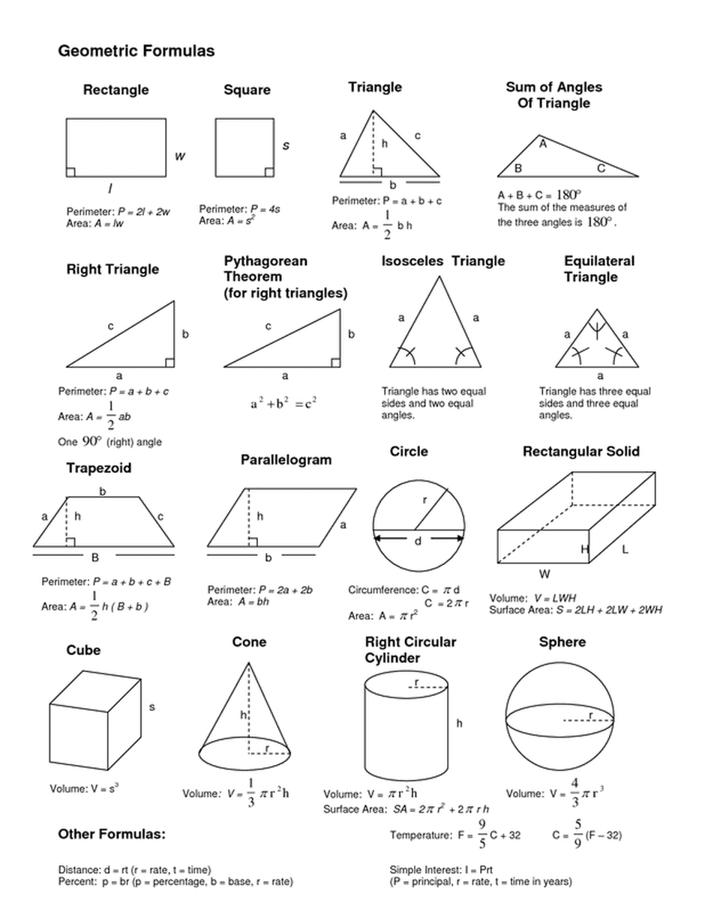
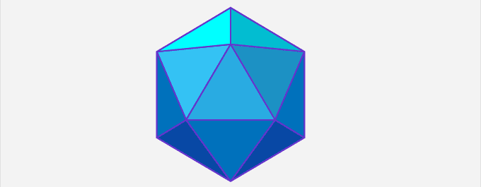
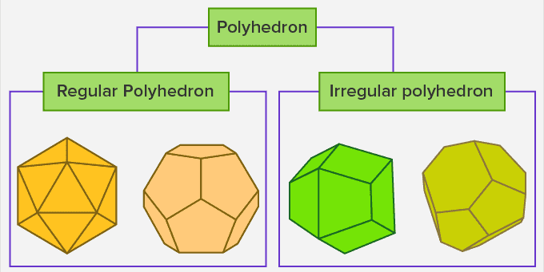

# Geometry

[[toc]]

[TOC]

---

## Area and perimeter

```c
              d
        |-----------|
      c |           |
        |-----------|
```

**Area** is the space inside of a two-dimensional shape. We can also think of area as the amount of space a shape covers.

**Oblast(Area)** predstavlja celo područje unutrašnjeg dela geometrijske figure, mereno u jedinicama. Oblast pravougaone figure je definisan proizvod dve strane, i moze se izračunati uz pomoć sledeće formule: $$O = d * c$$

$$ height \times width = area $$

**Perimeter** is the distance around the outside of a two-dimensional shape.To find the perimeter of a shape, we add all of the shape's side lengths.

**Perimetar** je distanca potrebna da se obidje oko nekog objekta, ili matematički rečeno zbir svih strana geometrijske figure. Može se izračunati uz pomoć sledeće formule: $$P = (d *c)* 2$$ $$ (height \times width) \times 2 = perimeter $$

### Area and perimeter formulas



## Lines

A **line** extends forever in both directions, like this:


A **line segment** is just part of a line. It has two endpoints, like this:


A **ray** starts at one point and continues on forever in one direction, like this:


**Perpendicular lines** are lines that meet at right angles.


Parallel lines are always the same distance apart from each other — no matter how far they are extended, they will never meet.


## Angles

An angle is two rays that share a vertex. Intersecting lines or line segments also form angles.

### Measuring angles

Angles are measured in degrees. The wider an angle is open, the greater its measure.

### Angle types

| Angle type | Angle size (in degrees)              |
| ---------- | ------------------------------------ |
| Acute      | Between $0\degree$ and $90\degree$   |
| Right      | Exactly $90\degree$                  |
| Obtuse     | Between $90\degree$ and $180\degree$ |
| Straight   | Exactly $180\degree$                 |

A **right angle** is a 90degree angle. A right angle is in the shape of a perfect corner, like the corner of a rectangular sheet of paper.

A **straight angle** is a 180-degree angle. A straight angle looks like a straight line.

An **acute angle** is an angle whose degree measure is less than 90 degrees.

An **obtuse angle** is an angle whose degree measure is greater than 90 degrees but less than 180 degrees.

## Triangles

### Triangle types

> All of the internal angles of a triangle equal 180 degrees.

A **scalene** triangle is a triangle where none of the sides are equal.

An **isosceles** triangle is an angle where we have at least two sides that have the same length.

An **equilateral** triangle is a triangle where all three sides have the same length.

An **acute** triangle is the triangle where all of the angles have less than 90$\degree$.

A **right** is a triangle that has an angle that is exactly 90$\degree$.

An **obtuse** triangle is a triangle that has an angle that is larger than 90$\degree$.

### Calculating Triangle Area problems

We have a triangle with a missing side. Its height is 10 units^2^ and the area is 75 units^2^. Find the missing side.

So, the formula for calculating area of a triangle is $A =\frac{1}{2}\times base \times height$, so we can rewrite this problem as: $75=\frac{1}{2}\times x \times 10$, which can simplified to $75=x \times 5$. We can then use rules for simplifying algebraic expressions to calculate this:

$$
\begin{aligned}
75&=x\times5 \\  \frac{75}{5}&=\frac{x \times \cancel{5}}{\cancel{5}}\\15&=x
\end{aligned}
$$

## Symmetry

A shape is symmetrical if it has at least one line of symmetry.

The _line of symmetry_ is the imaginary line where you could fold the image and have both halves match exactly.

## Quadrilaterals

> A quadrilateral is a polygon with four sides.


**Parallelogram** is a quadrilateral where opposite sides are parallel - going in the same direction:


> Every parallelogram can be made into a rectangle, which is why we use the same formula to find the area of a parallelogram and a rectangle.

**Rhombus** is a type of parallelogram - the opposite sides have to be parallel and all sides must be equal.


> Square is a rhombus

**Rectangle** is a kind of parallelogram where all the corners are the right angles.


**Square** is a parallelogram, rhombus, and rectangle.

---

### Quadrilateral Summary

| Name          | Definition                       |
| ------------- | -------------------------------- |
| Quadrilateral | 4 sided closed figure            |
| Parallelogram | 2 pairs of parallel sides        |
| Trapezoid     | Exactly 1 pair of parallel sides |
| Rectangle     | 4 right angles                   |
| Rhombus       | 4 equal sides                    |
| Square        | 4 equal sides and 4 right angles |

---

## Volume

Volume is the amount of 3-dimensional space an object occupies and it is measured in cubic units.

### Volume formulas


#### How to use the volume formulas to calculate the volume

##### Cube (Square)

Given that the length of a side = S = 2 cm:

$$
Volume = 2cm × 2cm × 2cm = 8cm^3 \newline
V = S^3
$$

If you know the volume of a cube you can determine the length of the sides by calculating the cube root.

$$
\sqrt[3]{S^3}
$$

Example:

-   Determine the side length of a cube with a volume of 1953.125 in.3

$$
\begin{aligned}
V&=s^3 \\
1953.125 &= s^3 \\
\sqrt[3]{1953.125^3} &= \sqrt[3]{s^3} \\
12.5 &= s
\end{aligned}
$$

Another problem for calculating the volume of cubes with fraction lengths:

-   A rectangular prism with a volume of 5 cubic units is filled with cubes with side lengths of $\frac{1}{3}$. How many $\frac{1}{3}$ unit cubes does it take to fill the prism?

    -   The volume of the prism is 5 cubic units. This means the prism can be filled with $5 \times 1$ unit cubes.
    -   There are 27 cubes with $\frac{1}{3}$-unit side length in 1 cubic unit.
    -   Since the rectangular prism is made up of 5 cubic units, we would have $5 \times 27$ total cubes with $\frac{1}{3}$-unit side lengths, which is equal to $5\times 27=135$

###### Volume with Fractional Edge Lengths and Unit Cubes


-   how many $\frac{1}{4}$cm cubes does it take to fill a prism if the prism is $1cm × \frac{7}{4}cm × 2cm$?
    -   We need to find for each side, independently, how many cubes would fit in that side.
        -   $\frac{1}{4}$ fits 4 times in the side 1.
        -   $\frac{1}{4}$ fits 7 times in the side $\frac{7}{4}$.
        -   $\frac{1}{4}$ fits 8 times in the side 2.
    -   The answer is then $4×7×8=224$
    -   Another way of answering would be by starting to write everything in multiples of , and then remove all the $\frac{}{4}$ from the denominators, which would also leave us with $4×7×8=224$
-   A rectangular prism with a volume of 3 cubic units is filled with cubes with side lengths of $\frac{1}{4}$. How many $\frac{1}{4}$ unit cubes does it take to fill the prism?
    -   The volume of the prism is 3 cube units. That means the prism can be filled with $3 \times 1$ unit cubes.
    -   Single unit cube can fit $4 \times \frac{1}{4}$-unit side lengths.
    -   That's: $\frac{4}{4}\times\frac{4}{4}\times\frac{4}{4}$, which leaves us with $4 \times4\times4=64$ per cube, when we remove $\frac{}{4}$s.
    -   So the answer is $3 \times 64=192$

---

##### Cylinder

Given that the height is 8 inches and the radius is 2 inches:

$$
Volume = \pi × r^2 × h = 3.14 × (2 in)^2 × 8 in = 3.14 × 4 × 8 in^3 \newline
Volume = 3.14 × 32 in^3 = 100.48 in^3
$$

---

##### Rectangular solid or cuboid

Given that the length is 6 cm, the width is 3 cm and the height is 5 cm:

$$
Volume = l × w  × h =  6 × 3 × 5 = 90 cm^3
$$

In case we know the area of the base, the volume of a rectangular prism can be found by multiplying the area of a base by the corresponding height:

$$
\text{Volume }= \greenD{\text{area of base}}\times \blueD{\text { height}}
$$

---

##### Sphere

Given that the radius = r = 20:

$$
Volume = (4 × π × r^3)/3 = [4 × 3.14 × (20)^3]/3 = 3.14 × (20)^3 × 4 \newline
Volume = 3.14 × 8000 × 4 = 3.14 × 32000 = 100480
$$

---

##### Cone

Given that the radius is equal to 3 and the height is equal to 4:

$$
Volume = (π × r^2 × h)/3 = [3.14 × (3)^2× 4]/3 = 3.14 × 9 × 4 \newline
Volume = 3.14 × 36 = 113.04
$$

##### Pyramid

Given that the pyramid has a height of 6 feet. If the base of a pyramid is a square with a length of 2 feet, find the volume.

$$
Volume = (B × h)/3 \newline
B = \text{area of base}  = 2 ft × 2 ft = 4 ft^2 \newline
Volume = (4 × 6)/3 ft^3 = 24/3 ft^3 = 8 ft^3
$$

##### Ellipsoid

Given that the radii of an ellipsoid are 1 cm, 2, cm, and 3 cm.

$$
Volume = (4 × π × a × b × c)/3 = (4 × 3.14 × 1 × 2 × 3)/3 \newline
Volume = ( 3.14 × 4 × 6)/3 = ( 3.14 × 24)/3 = 81.64/3 = 25.12 cm^3
$$

##### Hollow cylinder

The outer radius is 8, the internal radius is 6, and the height is 10.

$$
Volume = π × h ( R^2 - r^2) = π × 10 ( 8^2 - 6^2) = π × 10 ( 64 - 36) \newline
Volume = π × 10(28) = π × 280 = 879.2
$$

## Surface area

Surface area is the amount of space covering the outside of a three-dimensional shape. To calculate surface area, we add the areas of all the faces of the three-dimensional figure.

### Polyhedron

A polyhedron is a 3-dimensional solid made by joining together polygons.

> The word 'polyhedron' comes from two Greek words, poly meaning many, and hedron referring to surface.



If we know about the number of faces and the vertex of a polyhedron, the number of edges can be calculated using the ‘polyhedron formula’ or ‘Euler’s characteristic’:

$$
\chi =V-E+F \newline
 V-E+F=2
$$

where F, V, and E represents the number of faces, edges and vertices of the polyhedron respectively.

Every polyhedron has three parts:

-   Face: the flat surfaces that make up a polyhedron are called its faces. These faces are regular polygons.
-   Edge: the regions where the two flat surfaces meet to form a line segment are known as the edges.
-   Vertex: It is the point of intersection of the edges of the polyhedron. A vertex is also known as the corner of a polyhedron. The plural of vertex is called vertices.


The names of the polyhedrons are derived from the number of faces they have:

-   Tetrahedron - A polyhedron with 4 faces.
-   Pentahedron - A polyhedron with 5 faces.
-   Hexahedron - A polyhedron with 6 faces.
-   Heptahedron - A polyhedron with 7 faces.
-   Octahedron - A polyhedron with 8 faces.
-   Nonahedron - A polyhedron with 9 faces.
-   Decahedron - A polyhedron with 10 faces

#### Types of polyhedron



##### Regular Polyhedron

A regular polyhedron is made up of regular polygons. Such solids are also known as ‘platonic solids’

##### Irregular polyhedron

An irregular polyhedron is formed by polygons of different shapes where all the components are not the same. This means that all the sides of an irregular polyhedron are not equal.

## Coordinate Plane

A coordinate plane is a two-dimensional plane formed by the intersection of a vertical line (usually) called y-axis and a horizontal line (usually) called x-axis. These are perpendicular lines that intersect each other at zero, and this point is called the **origin**. The axes cut the coordinate plane into four equal sections, and each section is known as quadrant.


> The two-dimensional plane is called the **Cartesian plane**, or the coordinate plane and the axes are called the coordinate axes or x-axis and y-axis.

### Graphing coordinates

For graphing coordinates we are using ordered pairs (x, y), where x represents the point on the x-axis and y a point on the y-axis.

### Quadrants

The original intersecting number lines are dividing the coordinate plane into four areas, called quadrants. These are numbered, by tradition, using Roman numerals in a counterclockwise direction starting with the top, right quadrant, called Quadrant I.

-   Quadrant I: This is the quadrant with only positive values for both the x-axis and y-axis. $(x,y)$
-   Quadrant II, to its left, has negative x values and positive y values. $(-x,y)$
-   Quadrant III has both negative x and y values. $(-x,-y)$
-   Quadrant IV has negative y values and positive x values. $(x,-y)$

Nothing prevents a line or flat shape from starting in one quadrant and continuing into another. A circle, for example, could have a center at, say, (1, 3) and a radius of 10 units, allowing it to sweep through all four quadrants.

### Intercept

When a line crosses either the x-axis or y-axis, the point is called either the **x-intercept** or **y-intercept**. An intercept always happens when the value of the crossed axis is o:

[insert coordinate plane with straight line intercepting at (5, 0) and (0, 3); label both points with each coordinate pair]

Here the line intercepts the y-axis at 3, along the x-axis value of 0, and intercepts the x-axis at 5, along the y-axis value of 0.
