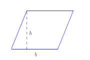
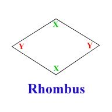
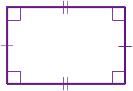

# Geometry

-   [Geometry](#geometry)
-   [Lines](#lines)
-   [Angles](#angles)
    -   [Measuring angles](#measuring-angles)
-   [Angle types](#angle-types)
-   [Triangle types](#triangle-types)
-   [Symmetry](#symmetry)
-   [Quadrilaterals](#quadrilaterals)
    -   [Quadrilateral Summary](#quadrilateral-summary)

---

```
              d
        |-----------|
      c |           |
        |-----------|
```

**Area** is the space inside of a two-dimensional shape. We can also think of area as the amount of space a shape covers.

**Oblast(Area)** predstavlja celo područje unutrašnjeg dela geometrijske figure, mereno u jedinicama. Oblast pravougaone figure je definisan proizvod dve strane, i moze se izračunati uz pomoć sledeće formule: $$O = d * c$$

$$ height \times width = area $$

**Perimeter** is the distance around the outside of a two-dimensional shape.To find the perimeter of a shape, we add all of the shape's side lengths.

**Perimetar** je distanca potrebna da se obidje oko nekog objekta, ili matematički rečeno zbir svih strana geometrijske figure. Može se izračunati uz pomoć sledeće formule: $$P = (d *c)* 2$$ $$ (height \times width) \times 2 = perimeter $$

## Lines

A **line** extends forever in both directions, like this:


A **line segment** is just part of a line. It has two endpoints, like this:


A **ray** starts at one point and continues on forever in one direction, like this:


**Perpendicular lines** are lines that meet at right angles.


Parallel lines are always the same distance apart from each other — no matter how far they are extended, they will never meet.


## Angles

An angle is two rays that share a vertex. Intersecting lines or line segments also form angles.

### Measuring angles

Angles are measured in degrees. The wider an angle is open, the greater its measure.

## Angle types

| Angle type | Angle size (in degrees)              |
| ---------- | ------------------------------------ |
| Acute      | Between $0\degree$ and $90\degree$   |
| Right      | Exactly $90\degree$                  |
| Obtuse     | Between $90\degree$ and $180\degree$ |
| Straight   | Exactly $180\degree$                 |

A **right angle** is a 90degree angle. A right angle is in the shape of a perfect corner, like the corner of a rectangular sheet of paper.

A **straight angle** is a 180 degree angle. A straight angle looks like a straight line.

An **acute angle** is an angle whose degree measure is less than 90 degree.

An **obtuse angle** is an angle whose degree measure is greater than 90 degree but less than 180 degree.

## Triangle types

> All of the internal angles of a triangle equal 180 degrees.

An **scalene** triangle is a triangle where none of the sides are equal.

An **isosceles** triangle is an angle where we have at least two sides that have same length.

An **equilateral** triangle is an triangle where all three sides have same length.

An **acute** tringle is the triangle where all of the angles have less than 90$\degree$.

An **right** is a triangle that have an angle that is exactly 90$\degree$.

An **obtuse** triangle is a triangle that have an angle that is larger than 90$\degree$.

## Symmetry

An shape is symmetrical if it has at least one line of symmetry.

The _line of symmetry_ is the imaginary line where you could fold the image and have both halves match exactly.

## Quadrilaterals

> A quadrilateral is a polygon with four sides.


**Parallelogram** is a quadrilateral where opposite sides are parallel - going in the same direction:



**Rhombus** is a type of parallelogram - the opossite sides have to be parallel and all sides must be equal.



> Square is a rhombus

**Rectangle** is kind of parallelogram where all the corners are the right angles.



**Square** is a parallelogram, rhombus and rectangle.

---

### Quadrilateral Summary

| Name          | Definition                       |
| ------------- | -------------------------------- |
| Quadrilateral | 4 sided closed figure            |
| Parallelogram | 2 pairs of parallel sides        |
| Trapezoid     | Exactly 1 pair of parallel sides |
| Rectangle     | 4 right angles                   |
| Rhombus       | 4 equal sides                    |
| Square        | 4 equal sides and 4 right angles |

---
